# Couples Question Card Game — Big Picture

**Selected shape:** C (PartyKit + Next.js)

---

## Frame

### Problem
- Couples avoid difficult conversations because they don't know how to start them
- When one partner suggests a topic, the other may feel put on the spot or defensive
- Questions written by one partner carry emotional weight and can feel like accusations
- Voting to skip publicly can hurt feelings
- No structured way to mix pre-written questions with personal ones without revealing sources

### Outcome
- Couples can have structured, meaningful conversations without social pressure
- Neither partner knows who authored which question (bundle vs custom vs which partner)
- Both partners can privately vote to discuss or skip without judgment
- The experience feels safe, collaborative, and fun
- Works seamlessly on two phones in real-time

---

## Shape

### Fit Check (R × C)

| Req | Requirement | Status | C |
|-----|-------------|--------|---|
| R0 | Two players join via link/code | Core goal | ✅ |
| R1 | Select bundles together in real-time | Core goal | ✅ |
| R2 | Add custom questions privately | Core goal | ✅ |
| R3 | LLM rephrases (OpenRouter) | Core goal | ✅ |
| R4 | Cannot distinguish question source | Must-have | ✅ |
| R5 | 30-second voting phase | Core goal | ✅ |
| R6 | Voting results are anonymous | Must-have | ✅ |
| R7 | Discuss if ≥1 votes Discuss | Core goal | ✅ |
| R8 | Skip if both vote Skip | Core goal | ✅ |
| R9 | Either player can click Next | Core goal | ✅ |
| R10 | Real-time sync | Must-have | ✅ |
| R11 | Mobile-first | Must-have | ✅ |
| R12 | No auth, ephemeral sessions | Must-have | ✅ |
| R18 | LLM via OpenRouter | Must-have | ✅ |

### Parts

| Part | Mechanism | Flag |
|------|-----------|:----:|
| **C1** | **PartyKit server** |
| C1.1 | room.ts — handles WebSocket connections, manages game state | |
| C1.2 | onConnect: add player to room, broadcast updated state | |
| C1.3 | onMessage: handle VOTE, NEXT, CONFIRM_BUNDLES, ADD_QUESTIONS, DONE | |
| C1.4 | State stored in room.storage (persisted) | |
| **C2** | **Game state shape** |
| C2.1 | phase: waiting \| bundles \| custom \| rephrasing \| voting \| discussion \| complete | |
| C2.2 | players: Map<id, { confirmed, done, questions[] }> | |
| C2.3 | selectedBundles: string[] | |
| C2.4 | currentQuestionIndex: number | |
| C2.5 | votes: Map<playerId, 'discuss' \| 'skip'> (never broadcast) | |
| C2.6 | questions: string[] (rephrased, shuffled) | |
| C2.7 | stats: { discussed, skipped, startedAt } | |
| **C3** | **Next.js frontend** |
| C3.1 | usePartySocket hook for WebSocket connection | |
| C3.2 | Phase-based rendering (single page, state-driven) | |
| C3.3 | Tailwind CSS with pastel theme config | |
| C3.4 | Google Fonts: Nunito or Quicksand | |
| **C4** | **LLM via OpenRouter** |
| C4.1 | API route /api/rephrase calls OpenRouter | |
| C4.2 | Model: claude-3-haiku or gpt-4o-mini | |
| C4.3 | System prompt for consistent warm tone | |
| C4.4 | PartyKit calls this route, then broadcasts rephrased questions | |
| **C5** | **Visual design** |
| C5.1 | Tailwind config: pastel colors (cream, blush, lavender, sage, peach) | |
| C5.2 | Rounded corners everywhere (rounded-2xl) | |
| C5.3 | Soft shadows (shadow-sm) | |
| C5.4 | Large tap targets (min-h-12 for buttons) | |
| C5.5 | Gentle transitions (transition-all duration-300) | |
| **C6** | **Deployment** |
| C6.1 | PartyKit Cloud for WebSocket server | |
| C6.2 | Vercel for Next.js frontend | |
| C6.3 | Environment variables: PARTYKIT_HOST, OPENROUTER_API_KEY | |
| C6.4 | Deploy after V1 to verify infrastructure | |

### Breadboard

See: [breadboard.md](./breadboard.md)

---

## Slices

### Sliced Breadboard

```mermaid
flowchart TB
    subgraph V1["V1: Session Creation"]
        U1["U1: Start button"]
        U2["U2: Code input"]
        U3["U3: Join button"]
        U5["U5: Code display"]
        U7["U7: Waiting msg"]
    end

    subgraph V2["V2: Bundle Selection"]
        U9["U9: Bundle list"]
        U10["U10: Toggle"]
        U13["U13: Confirm"]
    end

    subgraph V3["V3: Custom Questions"]
        U15["U15: Input"]
        U17["U17: My list"]
        U19["U19: Done"]
    end

    subgraph V4["V4: LLM Rephrasing"]
        U21["U21: Preparing"]
        U22["U22: Loader"]
        N36["N36: OpenRouter API"]
    end

    subgraph V5["V5: Voting"]
        U23["U23: Question"]
        U24["U24: Discuss"]
        U25["U25: Skip"]
        U26["U26: Timer"]
    end

    subgraph V6["V6: Discussion"]
        U29["U29: Question (large)"]
        U30["U30: Next"]
    end

    subgraph V7["V7: Complete"]
        U31["U31: Complete"]
        U32["U32: Stats"]
        U35["U35: Play Again"]
    end

    V1 ~~~ V2
    V2 ~~~ V3
    V3 ~~~ V4
    V4 ~~~ V5
    V5 ~~~ V6
    V6 ~~~ V7

    style V1 fill:#e8f5e9,stroke:#4caf50,stroke-width:2px
    style V2 fill:#e3f2fd,stroke:#2196f3,stroke-width:2px
    style V3 fill:#fff3e0,stroke:#ff9800,stroke-width:2px
    style V4 fill:#f3e5f5,stroke:#9c27b0,stroke-width:2px
    style V5 fill:#fff8e1,stroke:#ffc107,stroke-width:2px
    style V6 fill:#fce4ec,stroke:#e91e63,stroke-width:2px
    style V7 fill:#e0f2f1,stroke:#009688,stroke-width:2px
```

### Slices Grid

|  |  |  |
|:--|:--|:--|
| **[V1: Session & Deploy](./v1-plan.md)** ✅ COMPLETE  • Create session, get code • Join with code • WebSocket connection • Partner join detection • Deploy to Vercel + PartyKit  *Demo: Share live URL, both join from different devices* | **[V2: Bundle Selection](./slices.md#v2-bundle-selection)** ⏳ PENDING  • Bundle list from JSON • Toggle in real-time • Partner sees changes • Both confirm to advance  *Demo: Both toggle bundles, confirm, auto-advance* | **[V3: Custom Questions](./slices.md#v3-custom-questions)** ⏳ PENDING  • Private question input • Add/remove questions • Can't see partner's • Both done to advance  *Demo: Add questions privately, mark done, advance* |
| **[V4: LLM Rephrasing](./slices.md#v4-llm-rephrasing)** ⏳ PENDING  • Collect all questions • Call OpenRouter API • Rephrase for consistency • Shuffle and store  *Demo: Loading screen, then questions appear rephrased* | **[V5: Voting Phase](./slices.md#v5-voting-phase)** ⏳ PENDING  • Display question • 30-second timer • Discuss/Skip buttons • Anonymous outcome  *Demo: Vote discuss/skip, see outcome only* | **[V6: Discussion Phase](./slices.md#v6-discussion-phase)** ⏳ PENDING  • Question displayed large • No timer • Either clicks Next • Advance or complete  *Demo: Discuss, click Next, advance to next question* |
| **[V7: Session Complete](./slices.md#v7-session-complete)** ⏳ PENDING  • Stats: discussed, skipped • Duration shown • Play Again button • Creates new session  *Demo: See stats, click Play Again, restart* | • &nbsp; | • &nbsp; |

---

## Tech Stack

| Layer | Technology | URL |
|-------|------------|-----|
| Frontend | Next.js 15 (App Router), React 19, Tailwind CSS | https://questions-game-five.vercel.app |
| Real-time | PartyKit (Cloudflare) | https://questions-game.de-snake.partykit.dev |
| LLM | OpenRouter API | — |
| Fonts | Nunito (Google Fonts) | — |
| Code | GitHub | https://github.com/de-snake/questions-game |
| Deployment | Vercel (frontend) + PartyKit Cloud |

---

## Key Files

| File | Purpose |
|------|---------|
| [frame.md](./frame.md) | Problem and outcome |
| [shaping.md](./shaping.md) | Requirements, shapes, fit check |
| [breadboard.md](./breadboard.md) | UI/Code affordances, wiring |
| [slices.md](./slices.md) | Implementation slices |
| [v1-plan.md](./v1-plan.md) | V1 implementation + deployment |
