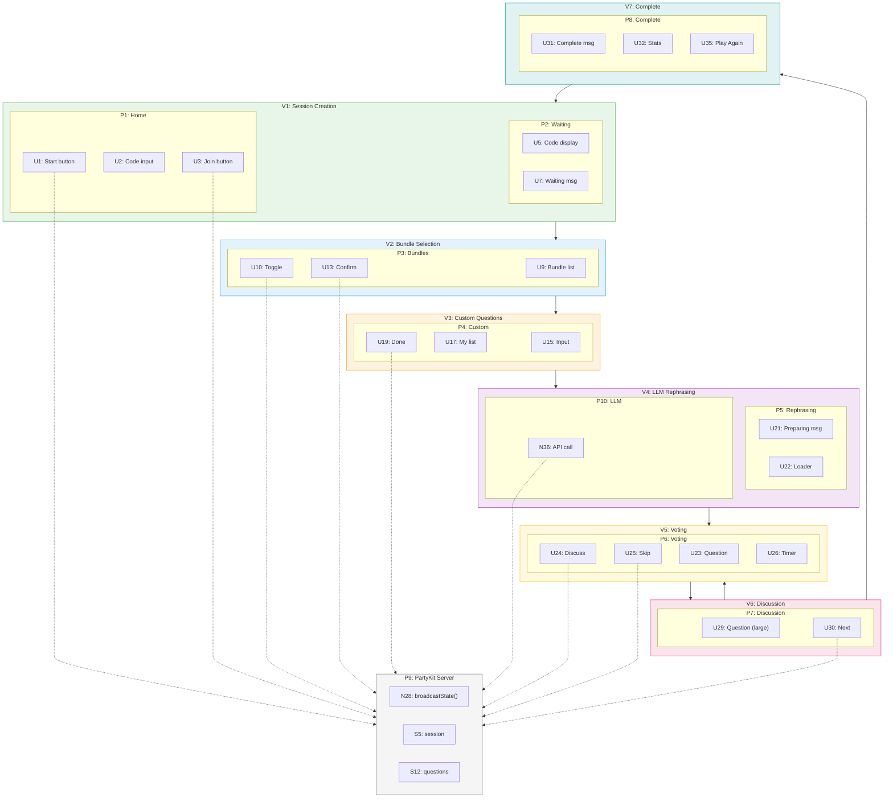

# Couples Question Card Game — Slices

## Slice Overview

| # | Slice | Mechanism | Demo |
|---|-------|-----------|------|
| V1 | Session Creation & Deploy | P1, P2, N1-N4, N20 + Vercel + PartyKit Cloud | "Share live URL with partner, both join from different devices" |
| V2 | Bundle Selection | P3, N5-N7, N23-N24, N29, N33 | "Both toggle bundles in real-time, confirm, advance to next phase" |
| V3 | Custom Questions | P4, N8-N11, N25, N30 | "Each player adds private questions, marks done, advances" |
| V4 | LLM Rephrasing | P5, P10, N12, N30, N36-N38 | "Loading screen, questions rephrased by OpenRouter, shuffled" |
| V5 | Voting Phase | P6, N13-N15, N18, N26, N31, N34 | "Question shown, 30s timer, both vote, outcome displayed" |
| V6 | Discussion Phase | P7, N16-N17, N27, N32, N35 | "Question displayed large, either clicks Next to advance" |
| V7 | Session Complete | P8, N19, N35 | "Stats shown, Play Again restarts flow" |

---

## V1: Session Creation & Deploy

**Plan:** [v1-plan.md](./v1-plan.md)

**Status:** ✅ COMPLETE (local)

**Mechanism:** Create new session, generate shareable code/link, allow partner to join, transition when both connected. Deploy to Vercel + PartyKit Cloud for real-world testing.

### Affordances

| # | Component | Affordance | Control | Wires Out | Returns To |
|---|-----------|------------|---------|-----------|------------|
| U1 | home | "Start New Session" button | click | → N1 | — |
| U2 | home | Room code input | type | → S1 | — |
| U3 | home | "Join Session" button | click | → N2 | — |
| U4 | home | Error message | render | — | — |
| U5 | waiting | Room code display | render | — | — |
| U6 | waiting | Share link display | render | — | — |
| U7 | waiting | "Waiting for partner..." | render | — | — |
| U8 | waiting | Partner joined indicator | render | — | — |
| N1 | home | `createSession()` | call | → P9 | → P2 |
| N2 | home | `joinSession(code)` | call | → P9 | → P2 or U4 |
| N3 | waiting | WebSocket connect | call | → P9 | — |
| N4 | waiting | `onPartnerJoined` | observe | → P3 | — |
| **Deployment** |
| N5 | deploy | `vercel --prod` | call | → Vercel | → live URL |
| N6 | deploy | `partykit deploy` | call | → PartyKit Cloud | → WebSocket URL |
| S2 | deploy | `NEXT_PUBLIC_PARTYKIT_HOST` | config | — | — |
| S3 | deploy | `OPENROUTER_API_KEY` | config | — | — |
| N20 | server | `onConnect` | event | → S5 | — |
| S1 | client | `roomCode` | store | — | — |
| S2 | client | `error` | store | — | — |
| S3 | client | `sessionId` | store | — | — |
| S5 | server | `session` | store | — | — |

### Demo Script
1. **Local test:** ✅ Two tabs: create + join, both see partner joined
2. **Deploy:** Push to Vercel + PartyKit Cloud
3. **Live test:** Share URL with partner on different device, both join, see partner joined

### Implementation Complete

Files created:
- `app/layout.tsx` - Root layout with Nunito font
- `app/page.tsx` - Main page with phase-based rendering
- `app/globals.css` - Tailwind + pastel theme
- `hooks/use-game-state.ts` - WebSocket connection + state
- `components/home-screen.tsx` - Create/join UI
- `components/waiting-screen.tsx` - Waiting for partner
- `party/room.ts` - PartyKit server
- `tailwind.config.ts` - Pastel colors
- `partykit.json` - PartyKit config

---

## V2: Bundle Selection

**Mechanism:** Both players see bundle list, toggle selections in real-time, confirm when ready, advance when both confirmed.

### Affordances

| # | Component | Affordance | Control | Wires Out | Returns To |
|---|-----------|------------|---------|-----------|------------|
| U9 | bundle-selection | Bundle list | render | — | — |
| U10 | bundle-card | Toggle checkbox | click | → N5 | — |
| U11 | bundle-card | Bundle name & description | render | — | — |
| U12 | bundle-selection | Partner's selections indicator | render | — | — |
| U13 | bundle-selection | "Confirm" button | click | → N6 | — |
| U14 | bundle-selection | "Waiting for partner..." | render | — | — |
| N5 | bundle-selection | `toggleBundle(id)` | call | → P9 | — |
| N6 | bundle-selection | `confirmBundles()` | call | → P9 | — |
| N7 | bundle-selection | `onBothConfirmed` | observe | → P4 | — |
| N23 | server | `handleToggleBundle` | call | → S6, → broadcast | — |
| N24 | server | `handleConfirmBundles` | call | → S7, → broadcast | — |
| N28 | server | `broadcastState()` | call | → clients | — |
| N29 | server | `checkBothConfirmed` | call | → N33 | — |
| N33 | server | `transitionToCustom()` | call | → S5, → broadcast | — |
| S6 | server | `selectedBundles` | store | — | — |
| S7 | server | `confirmedPlayers` | store | — | — |

### Demo Script
1. Both tabs show 3 bundles: "Arthur Aron", "Values & Future", "Getting to Know You"
2. Tab A toggles "Arthur Aron" → both tabs show it selected
3. Tab B toggles "Values & Future" → both tabs show it selected
4. Tab A clicks "Confirm" → sees "Waiting for partner..."
5. Tab B clicks "Confirm" → both auto-advance to Custom Questions

---

## V3: Custom Questions

**Mechanism:** Each player privately adds questions (not synced), marks done when finished, advances when both done.

### Affordances

| # | Component | Affordance | Control | Wires Out | Returns To |
|---|-----------|------------|---------|-----------|------------|
| U15 | custom-questions | Question input | type | → S4 | — |
| U16 | custom-questions | "Add" button | click | → N8 | — |
| U17 | custom-questions | My questions list | render | — | — |
| U18 | custom-questions | Remove question button | click | → N9 | — |
| U19 | custom-questions | "I'm Done" button | click | → N10 | — |
| U20 | custom-questions | "Waiting for partner..." | render | — | — |
| N8 | custom-questions | `addQuestion(text)` | call | → S4 | — |
| N9 | custom-questions | `removeQuestion(id)` | call | → S4 | — |
| N10 | custom-questions | `markDone()` | call | → P9 | — |
| N11 | custom-questions | `onBothDone` | observe | → P5 | — |
| N25 | server | `handleMarkDone` | call | → S8, → N30 | — |
| N30 | server | `checkBothDone` | call | → P10 | — |
| S4 | client | `myQuestions` | store | — | — |
| S8 | server | `donePlayers` | store | — | — |

### Demo Script
1. Both tabs show question input
2. Tab A adds 2 questions → sees them in list (Tab B doesn't see them)
3. Tab B adds 3 questions → sees them in list (Tab A doesn't see them)
4. Tab A clicks "I'm Done" → sees "Waiting for partner..."
5. Tab B clicks "I'm Done" → both auto-advance to Rephrasing

---

## V4: LLM Rephrasing

**Mechanism:** Collect all questions (bundles + custom from both), send to OpenRouter, rephrase for consistent tone, shuffle, store.

### Affordances

| # | Component | Affordance | Control | Wires Out | Returns To |
|---|-----------|------------|---------|-----------|------------|
| U21 | rephrasing | "Preparing your questions..." | render | — | — |
| U22 | rephrasing | Animated loader | render | — | — |
| N12 | rephrasing | `rephraseQuestions()` | call | → P10 | — |
| N36 | api | `POST /api/rephrase` | call | → OpenRouter | → N37 |
| N37 | api | `parseResponse()` | call | → N38 | — |
| N38 | api | `shuffleQuestions()` | call | → S12 | — |
| S12 | server | `questions` | store | — | — |

### Demo Script
1. Both tabs show "Preparing your questions..." with spinner
2. Server calls OpenRouter API with all questions
3. Response parsed, questions shuffled
4. Both tabs auto-advance to Voting

---

## V5: Voting Phase

**Mechanism:** Display question, 30s timer, both vote privately, determine outcome (discuss if ≥1 discuss, skip if both skip), advance.

### Affordances

| # | Component | Affordance | Control | Wires Out | Returns To |
|---|-----------|------------|---------|-----------|------------|
| U23 | voting | Question display | render | — | — |
| U24 | voting | "Discuss" button | click | → N13 | — |
| U25 | voting | "Skip" button | click | → N14 | — |
| U26 | voting | 30-second timer | render | — | — |
| U27 | voting | "Waiting for partner..." | render | — | — |
| U28 | voting | "Skipped" transition | render | — | — |
| N13 | voting | `vote('discuss')` | call | → P9 | — |
| N14 | voting | `vote('skip')` | call | → P9 | — |
| N15 | voting | `onVoteComplete` | observe | → P7 or P6 | — |
| N18 | voting | `advanceToNext()` | call | → P9 | — |
| N26 | server | `handleVote` | call | → S9, → N31 | — |
| N31 | server | `checkVoteComplete` | call | → N34 | — |
| N34 | server | `determineVoteOutcome()` | call | → S11, → broadcast | — |
| S9 | server | `votes` | store | — | — |
| S10 | server | `currentQuestionIndex` | store | — | — |
| S11 | server | `voteOutcome` | store | — | — |

### Demo Script
1. Both tabs show first question
2. Timer starts at 30 seconds
3. Tab A clicks "Discuss" → sees "Waiting for partner..."
4. Tab B clicks "Discuss" → both advance to Discussion
5. (Alt: both click "Skip" → brief "Skipped" message, next question)

---

## V6: Discussion Phase

**Mechanism:** Display question large, either player can click Next to advance, check if session complete.

### Affordances

| # | Component | Affordance | Control | Wires Out | Returns To |
|---|-----------|------------|---------|-----------|------------|
| U29 | discussion | Question display (large) | render | — | — |
| U30 | discussion | "Next" button | click | → N16 | — |
| N16 | discussion | `nextQuestion()` | call | → P9 | — |
| N17 | discussion | `onPhaseChange` | observe | → P6 or P8 | — |
| N27 | server | `handleNext` | call | → N32 | — |
| N32 | server | `advanceQuestion()` | call | → S10, → N35 | — |
| N35 | server | `checkSessionComplete()` | call | → P8 or P6 | — |

### Demo Script
1. Both tabs show question in large text
2. Couple discusses (no timer)
3. Tab A clicks "Next" → both advance to next question's Voting phase
4. Repeat until all questions done

---

## V7: Session Complete

**Mechanism:** Display stats, offer "Play Again" which creates new session.

### Affordances

| # | Component | Affordance | Control | Wires Out | Returns To |
|---|-----------|------------|---------|-----------|------------|
| U31 | complete | "Session Complete!" | render | — | — |
| U32 | complete | Stats: discussed count | render | — | — |
| U33 | complete | Stats: skipped count | render | — | — |
| U34 | complete | Stats: duration | render | — | — |
| U35 | complete | "Play Again" button | click | → N19 | — |
| N19 | complete | `playAgain()` | call | → N1 | — |

### Demo Script
1. Both tabs show "Session Complete!"
2. Stats displayed: "8 discussed, 4 skipped, 12 minutes"
3. Either clicks "Play Again" → both return to Home with new session created

---

## Sliced Breadboard Diagram

---

## Implementation Order

1. **V1**: Next.js app, PartyKit server, WebSocket connection, session create/join
2. **V2**: Bundle data (JSON), selection UI, real-time sync
3. **V3**: Question input form, local state, done flag sync
4. **V4**: OpenRouter API route, rephrasing prompt, shuffle
5. **V5**: Question display, timer, vote buttons, outcome logic
6. **V6**: Discussion UI, next button, advance logic
7. **V7**: Stats calculation, complete screen, play again

Each slice is independently deployable and demoable.
